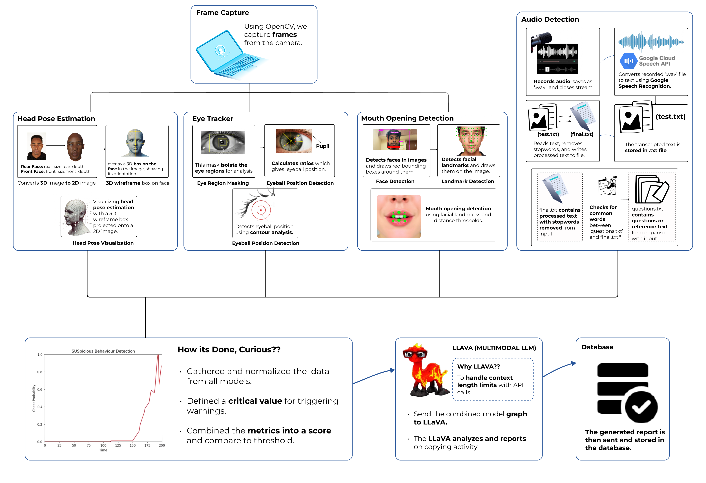
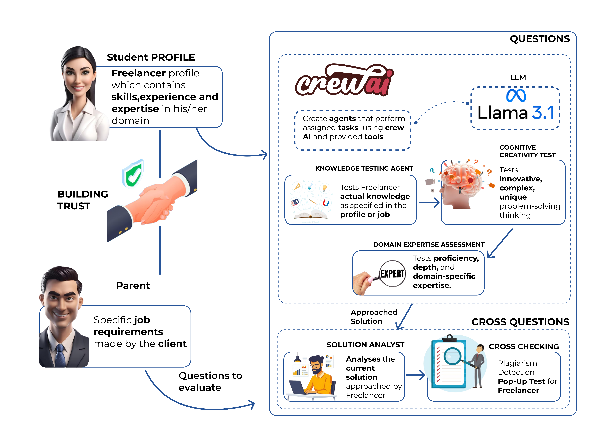

# EduSlate - AI-Powered Learning Platform

EduSlate is a comprehensive, AI-driven educational platform designed to enhance independent learning for students. The platform leverages cutting-edge technologies like Whisper for transcription, Gemini for AI-powered question generation, Mediapipe for real-time interactive sessions, and more. EduSlate empowers students to translate and interact with educational content, receive tailored feedback, and engage in virtual classrooms, all while ensuring a seamless, scalable, and secure experience.

## Architecture Diagram 

### Features

1. **Document Interaction:**
   - Upload documents and ask questions about the content.
   - Auto-generated questions based on the uploaded documents for enhanced learning.
   - Instant evaluation of answers with AI-based assessment.

2. **Video Transcription and Translation:**
   - Transcribe YouTube videos using Whisper.
   - Translate video content into the user’s preferred language.
   - Text-to-speech functionality synced with video playtime.

3. **Virtual Interactive Learning:**
   - Real-time virtual meetings between students and teachers.
   - Teachers can conduct lessons, ask questions, and resolve doubts using interactive AI features powered by Mediapipe and Gemini.

4. **Proctoring System:**
   - Prevents plagiarism during exams using advanced monitoring systems.
   - Includes mouth detection, eye tracking, head pose detection, audio detection, and phone detection.
   - AI-generated graphs to identify unusual behavior.

5. **AI-Generated Questions:**
   - Tailored questions are generated by AI agents using Gemini, improving students' skills and comprehension.
   - Real-time pop-up questions for enhancing spontaneous thinking.

6. **Reports and Notifications:**
   - Reports generated using Gemini are sent to parents via email.
   - Notifications sent from the website to keep parents informed of their child's progress.

### Technologies Used

1. **Whisper** - For speech-to-text transcription of videos.
2. **Gemini** - AI-powered question generation and content tailoring.
3. **Mediapipe** - Real-time video analytics and interactive features during virtual lessons.
4. **TensorFlow** - For AI model development and deployment.
5. **Flask** - Backend web framework.
6. **Node.js** - Real-time processing and communication.
7. **MongoDB** - Database for storing user data and reports.
8. **Firebase** - Authentication and real-time notifications.
9. **AWS** - Cloud hosting and scalable infrastructure.
10. **React** - Front End.
11. **Google Translate** - For Multilingual Support.
12. **Open CV** - For Image processing.

### Installation

1. **Clone the Repository:**
   ```bash
   git clone https://github.com/YourUsername/EduSlate.git
   cd EduSlate
   ```

2. **Create a Virtual Environment:**
   ```bash
   python3 -m venv env
   source env/bin/activate   # On Windows: `env\Scripts\activate`
   ```

3. **Install Dependencies:**
   ```bash
   pip install -r requirements.txt
   ```

4. **Set Up Environment Variables:**
   Create a `.env` file in the root directory with the necessary API keys and configuration settings.

5. **Run the Application:**
   ```bash
   flask run
   ```

6. **Access the Application:**
   Open your browser and navigate to `http://127.0.0.1:5000/`.

### Usage

- **Upload Documents:** Students can upload documents to receive AI-generated questions and feedback.
- **Transcribe and Translate Videos:** Students can input YouTube video links, and the platform will transcribe, translate, and sync audio playback.
- **Join Virtual Classes:** Teachers and students can connect via virtual meetings for interactive learning sessions.
- **AI Proctoring:** The platform monitors students during exams to prevent plagiarism and ensure fair assessments.
- **View Reports:** Parents can receive detailed progress reports via email and web notifications.

### Future Opportunities

1. **Expanded Language Support** for transcription and translation.
2. **AI-Powered Personalization** for tailored learning experiences.
3. **Mobile App Development** for on-the-go learning.
4. **LMS Integration** to streamline educational workflows.
5. **Gamification Features** to boost student engagement.

### Features Architecture 
## AI Proctoring Test 


## AI Question Generation


## Evaluation Report 

